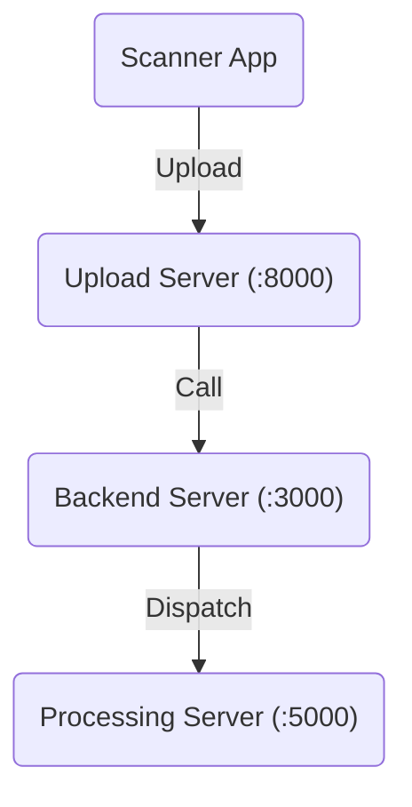

# In addition to the original repository

Please check the commit history for the specific modifications.

For making the project, please first check the original documentations

- https://3dlg-hcvc.github.io/multiscan/read-the-docs/server/index.html
- https://3dlg-hcvc.github.io/multiscan/read-the-docs/web-ui/index.html

Then please refer to [this slide](./MT-part.pdf) for more details.

After the making step is all done, to start the server, please run the following command:

## Upload server

In the `server` directory, run the following command:

```bash
python upload.py
```

## Processing server

In the `server` directory, run the following command:

```bash
python process.py
```

Use `CUDA_VISIBLE_DEVICES` to adjust the GPU device.

## Backend Server

In the `web-ui/web-server` directory, run the following command:

```bash
npm start
```

## Brief Explanation of part used

Here is a diagram of calling traceback of the servers,



## Tip

If processing failed after upload due to what ever reason, we can always use the URL of the following form to reprocess the scan:

```
http://<HOST>:5000/process/<STAGING_UUID>?overwrite=0&actions=["convert", "recons", "texturing", "segmentation", "render", "thumbnail"]
```

The following is an example of the URL:

```
http://localhost:5000/process/20231203T163511-0500_35B770E8-8B8A-41FB-B1D5-8D9687246ECA?overwrite=0&actions=["convert", "recons", "texturing", "segmentation", "render", "thumbnail"]
```

## Scripts Added

### `server/crop.py`

This script is used for cropping the scan data to a smaller size to deal with CUDA OOM and other issues.

```
cd server && python crop.py
```

Configurations below,

```
#### Configurations ####
src = '20231208T164356-0500_2D50E931-A486-4EDE-A859-2982CCB91A95'
unit = 600
frame_skip = 10
########################
```

Notice that `src` is the staging UUID of the scan. Please change the code if you are not using the default staging directory.

Also notice that in `config.yaml` there is a field called `decode.step`. `frame_skip` refers to this value. I do not implement the `depth_skip`, the whole code is based on `skip=10` and `depth_skip=1`. Feel free to change the code if you want to use other values.

Under this scenario, `unit` refers to the number of frames (of the color frames) in each cropped scan.

For example, if `unit=600`, `frame_skip=10`, `depth_skip=1`, then the cropped scan will each (except the last) have (600 * 10 * 2 = 12000) depth frames and (600 * 2 = 1200) color frames. In terms of color frames, the crops will be `[0, 1200], [600, 1800], [1200, 2400]`, ... and so on.

Feel free to change the code if you want to try other overlapping strategies.

> For those who are using https://github.com/JeffersonQin/DungeonAssistant, the `overlap_discard_num` of `multi_merger_viewer.py` is the number of frames to discard in the beginning of each crop. It should also be changed if you switch the overlapping strategy.

The cropped scan will be saved in the staging directory with the name `src + '-{:02d}'`.

### `server/pipelining.py`

After cropping the scan, we can use this script to process the cropped scans in a pipelining manner.

```
cd server && python pipelining.py
```

The code is very straightforward, please modify the code for your own usage. I am not planning to make it a command line tool.

## Mystries

Hope this can help someone who is trying to use this project.

* I tried to increase the num_cpu to 48, but then the processing server will report CUDA OOM and crash. No idea why this happen.

## Troubleshooting

For VSCode users, if you are using the Remote SSH extension, please make sure that the `Remote: Local Port Host` is set to `allInterfaces` in the settings. Otherwise, the terminal devices will not be able to connect to the server.


<div align="center">
    <p>Below is the original README.md</p>
</div>

---

# MultiScan: Scalable RGBD scanning for 3D environments with articulated objects

<h4>
    <a href="https://3dlg-hcvc.github.io/multiscan/">Project</a> |
    <a href="https://openreview.net/forum?id=YxUdazpgweG">Paper</a> |
    <a href="https://3dlg-hcvc.github.io/multiscan/read-the-docs/index.html">Docs</a>
</h4>

MultiScan is a scalable RGBD dataset construction pipeline leveraging commodity mobile devices to scan indoor scenes with articulated objects and web-based semantic annotation interfaces to efficiently annotate object and part semantics and part mobility parameters. 


The repository includes:

* Source code of iOS and Android scanning apps
* Processing server for 3D reconstruction, texturing and segmentation
* Web interface for browsing scans and initiate processings
* Source code of benchmark dataset preparation
* Source code of data visualization

-----------------------------------

## MultiScan Dataset

Download and copy MultiScan dataset [download script](https://forms.gle/YuE2gZTMSBoJiLDh7) to `[PROJECT_ROOT]/dataset` directory, and run download script to dowload the dataset:

```bash
./dataset/download.sh <output_dir>
```
Unzip files:
```bash
cd <output_dir>
unzip "*.zip"
```

The downloaded dataset would follow this [file system structure](https://3dlg-hcvc.github.io/multiscan/read-the-docs/dataset/index.html#file-system-structure).

MultiScan dataset includes:
1. Acquired data from scanner app: [doc](https://3dlg-hcvc.github.io/multiscan/read-the-docs/dataset/files/acquired.html)
2. Output data from processing server: [doc](https://3dlg-hcvc.github.io/multiscan/read-the-docs/dataset/files/output.html)
3. Annotation data: [doc](https://3dlg-hcvc.github.io/multiscan/read-the-docs/dataset/files/annotation.html)

## MultiScan Benchmark Dataset

Download and copy MultiScan benchmark dataset [download script](https://forms.gle/YuE2gZTMSBoJiLDh7) to `[PROJECT_ROOT]/dataset` directory, and follow the instructions bellow to dowload the MultiScan benchmark dataset:

#### Object instance segmentation
Preprocessed object instance segmentation data download:
```bash
./dataset/download_benchmark_dataset.sh -o <output_dir>
```

#### Part instance segmentation
Preprocessed part instance segmentation data download:
```bash
./dataset/download_benchmark_dataset.sh -p <output_dir>
```

#### Mobility prediction
Preprocessed articulated objects dataset download:
```bash
./dataset/download_benchmark_dataset.sh -a <output_dir>
```

Unzip files with:
```bash
cd <output_dir>
unzip "*.zip"
```

Please checkout [benchmark dataset doc](dataset/README.md) for information about preprocessed dataset download and the preprocess scripts.

-----------------------------------

## Scanner App

The Scanner App collects data using sensors on an Android/iOS device. User moves around holding the device with Scanner app installed to scan the scene. Once the scanning is completed, users can upload the data to the processing server.
* source code for iOS scanning app: [iOS code](scanner/ios)
* documentation for iOS scanning app: [iOS doc](https://3dlg-hcvc.github.io/multiscan/read-the-docs/scanner/index.html#ios)
* source code for Android scanning app: [Android code](scanner/android)
* documentation for Android scanning app: [Android doc](https://3dlg-hcvc.github.io/multiscan/read-the-docs/scanner/index.html#android)

-----------------------------------

## Processing Server
The staging server has 3 main functionalities:

1. Stage uploaded scans by the devices (iOS or Android) and trigger scan processing. To ensure that scans can be automatically processed, the scans should be placed in a directory with lots of space and accessible to the scanning processor.
2. Process staged scans. Handle reconstruction processing request from Web-UI, when user press interactive buttons on Web-UI.
3. Index staged scans. Go through scan folders and collate information about the scans.
* source code for processing server: [server code](server)
* installation doc for processing server: [install](https://3dlg-hcvc.github.io/multiscan/read-the-docs/server/index.html#installation)
* configurations and documentations for processing server: [doc](https://3dlg-hcvc.github.io/multiscan/read-the-docs/server/index.html#configurations)


### Staging Data Formats

Details about the formats of the uploaded files, and data generated by the processing server are available at [**here**](./docs/staging_file_format.md)

-----------------------------------

## Web-UI

The [Web-UI](../web-ui) is an interactive interface for providing an overview of staged scan data, managing scan data, and controlling the reconstruction and mesh annotation pipeline.
- source code to webui server backend: [web-server code](web-ui/web-server)
- source code to webui client frontend: [web-client code](web-ui/web-client)
- Web-UIinstallation and usuage documentation: [doc](https://3dlg-hcvc.github.io/multiscan/read-the-docs/web-ui/index.html#web-ui)

-----------------------------------

## Benchmark

With MultiScan dataset, we carry out a series of benchmark experiments to evaluate methods from recent work on object instance segmentation, part instance segmentation, and mobility prediction.

Please checkout [benchmark dataset doc](dataset/README.md) for information about preprocessed dataset download and the preprocess scripts.

Benchmark train/val/test split and selected object/part semantic label and IDs:
* train/val/test split [scans_split.csv](dataset/benchmark/scans_split.csv)
* object label to semantic label/ID mapping [object_semantic_label_map.csv](dataset/benchmark/object_semantic_label_map.csv)
* part label to semantic label/ID mapping [part_semantic_label_map.csv](dataset/benchmark/part_semantic_label_map.csv)

-----------------------------------

## Visualization

### Annotations visualization

Turntable video visualizations for semantic label annotation, semantic OBB annotation, articulation annotation, and textured mesh of the scans. Please checkout the [visualization doc](visualization/README.md) for more information.

-----------------------------------

## Citation

If you use the MultiScan data or code please cite:

    @inproceedings{mao2022multiscan,
        author = {Mao, Yongsen and Zhang, Yiming and Jiang, Hanxiao and Chang, Angel X, Savva, Manolis},
        title = {MultiScan: Scalable RGBD scanning for 3D environments with articulated objects},
        booktitle = {Advances in Neural Information Processing Systems},
        year = {2022}
    }

-----------------------------------

## References

Our work is built on top of the ScanNet dataset acquisition framework, Open3D, and MVS-Texturing for 3D reconstruction.
We use the Open3D, Pyrender, MeshLab and Instant Meshes for rendering and post-processing.

    @misc{dai2017scannet,
        title={ScanNet: Richly-annotated 3D Reconstructions of Indoor Scenes}, 
        author={Angela Dai and Angel X. Chang and Manolis Savva and Maciej Halber and Thomas Funkhouser and Matthias Nießner},
        year={2017},
        eprint={1702.04405},
        archivePrefix={arXiv},
        primaryClass={cs.CV}
    }

    @article{Zhou2018,
        author    = {Qian-Yi Zhou and Jaesik Park and Vladlen Koltun},
        title     = {{Open3D}: {A} Modern Library for {3D} Data Processing},
        journal   = {arXiv:1801.09847},
        year      = {2018},
    }

    @inproceedings{Waechter2014Texturing,
        title    = {Let There Be Color! --- {L}arge-Scale Texturing of {3D} Reconstructions},
        author   = {Waechter, Michael and Moehrle, Nils and Goesele, Michael},
        booktitle= {Proceedings of the European Conference on Computer Vision},
        year     = {2014},
        publisher= {Springer},
    }

    @article{Jakob2015Instant,
        author = {Wenzel Jakob and Marco Tarini and Daniele Panozzo and Olga Sorkine-Hornung},
        title = {Instant Field-Aligned Meshes},
        journal = {ACM Transactions on Graphics (Proceedings of SIGGRAPH ASIA)},
        volume = {34},
        number = {6},
        year = {2015},
        month = nov,
        doi = {10.1145/2816795.2818078},
    }

    @inproceedings{LocalChapterEvents:ItalChap:ItalianChapConf2008:129-136,
        booktitle = {Eurographics Italian Chapter Conference},
        editor = {Vittorio Scarano and Rosario De Chiara and Ugo Erra},
        title = {{MeshLab: an Open-Source Mesh Processing Tool}},
        author = {Cignoni, Paolo and Callieri, Marco and Corsini, Massimiliano and Dellepiane, Matteo and Ganovelli, Fabio and Ranzuglia, Guido},
        year = {2008},
        publisher = {The Eurographics Association},
        ISBN = {978-3-905673-68-5},
        DOI = {10.2312/LocalChapterEvents/ItalChap/ItalianChapConf2008/129-136}
    }
